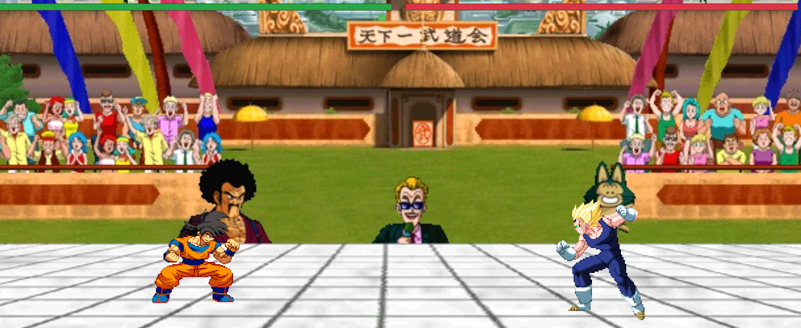

# Dragon Ball Z Battle Game

Willkommen zu **Dragon Ball Z Battle Game**, einem Kampfspiel mit deinen Lieblings-Dragon-Ball-Z-Charakteren: Son Goku und Vegeta! Teste deine Fähigkeiten und finde heraus, wer der stärkste Krieger ist.

## Funktionen

- **Zwei spielbare Charaktere**: Wähle zwischen Son Goku und Vegeta.
- **Angriffe und Spezialattacken**: Führe verschiedene Angriffe wie Punch, Kick und Super-Attacken aus.
- **Lebensleisten**: Jede Attacke reduziert die Lebensleiste des Gegners.
- **Game Over-Bildschirm**: Sobald ein Spieler keine Lebenspunkte mehr hat, erscheint der Game Over-Bildschirm mit einer Neustartoption.

## Steuerung

### Son Goku (Player One):
- **W**: Power Attacke
- **A**: Punch (Schlag)
- **S**: Kick (Tritt)
- **D**: Super Attacke

### Vegeta (Player Two):
- **↑**: Power Attacke
- **←**: Punch (Schlag)
- **↓**: Kick (Tritt)
- **→**: Super Attacke

## Gameplay

Das Ziel ist es, die Lebensleiste deines Gegners auf 0 zu bringen, bevor deine eigene Lebensleiste leer ist. Nutze deine Angriffe weise, um Schaden zu verursachen, und achte darauf, wann der Game Over-Bildschirm erscheint.

---

Mit lieben Grüßen,  
**Euer Dawydos**

# Dragon Ball Z Battle Game

Welcome to **Dragon Ball Z Battle Game**, a combat game featuring your favorite Dragon Ball Z characters: Son Goku and Vegeta! Test your skills and find out who the strongest warrior is.

## Features

- **Two playable characters**: Choose between Son Goku and Vegeta.
- **Attacks and special moves**: Perform various attacks like Punch, Kick, and Super Attacks.
- **Health bars**: Each attack reduces the opponent's health bar.
- **Game Over screen**: Once a player runs out of health, the Game Over screen appears with a restart option.

## Controls

### Son Goku (Player One):
- **W**: Power Attack
- **A**: Punch
- **S**: Kick
- **D**: Super Attack

### Vegeta (Player Two):
- **↑**: Power Attack
- **←**: Punch
- **↓**: Kick
- **→**: Super Attack

## Gameplay

The goal is to reduce your opponent’s health bar to 0 before your own health runs out. Use your attacks wisely to inflict damage and watch for when the Game Over screen appears.

---

Best regards,  
**Yours, Dawydos**

# Gra Walki Dragon Ball Z

Witamy w **Grze Walki Dragon Ball Z**, grze walki z twoimi ulubionymi postaciami z Dragon Ball Z: Son Goku i Vegeta! Sprawdź swoje umiejętności i dowiedz się, kto jest najsilniejszym wojownikiem.

## Funkcje

- **Dwie grywalne postacie**: Wybierz pomiędzy Son Goku a Vegetą.
- **Ataki i specjalne ruchy**: Wykonuj różne ataki, takie jak ciosy, kopnięcia i super ataki.
- **Paski zdrowia**: Każdy atak zmniejsza pasek zdrowia przeciwnika.
- **Ekran Game Over**: Gdy jeden z graczy straci zdrowie, pojawia się ekran Game Over z opcją restartu.

## Sterowanie

### Son Goku (Gracz Pierwszy):
- **W**: Atak mocy
- **A**: Cios
- **S**: Kopnięcie
- **D**: Super atak

### Vegeta (Gracz Drugi):
- **↑**: Atak mocy
- **←**: Cios
- **↓**: Kopnięcie
- **→**: Super atak

## Rozgrywka

Celem gry jest zredukowanie paska zdrowia przeciwnika do 0, zanim twoje zdrowie się skończy. Używaj ataków mądrze, aby zadać obrażenia, i obserwuj, kiedy pojawi się ekran Game Over.

---

Z pozdrowieniami,  
**Twój Dawydos**
